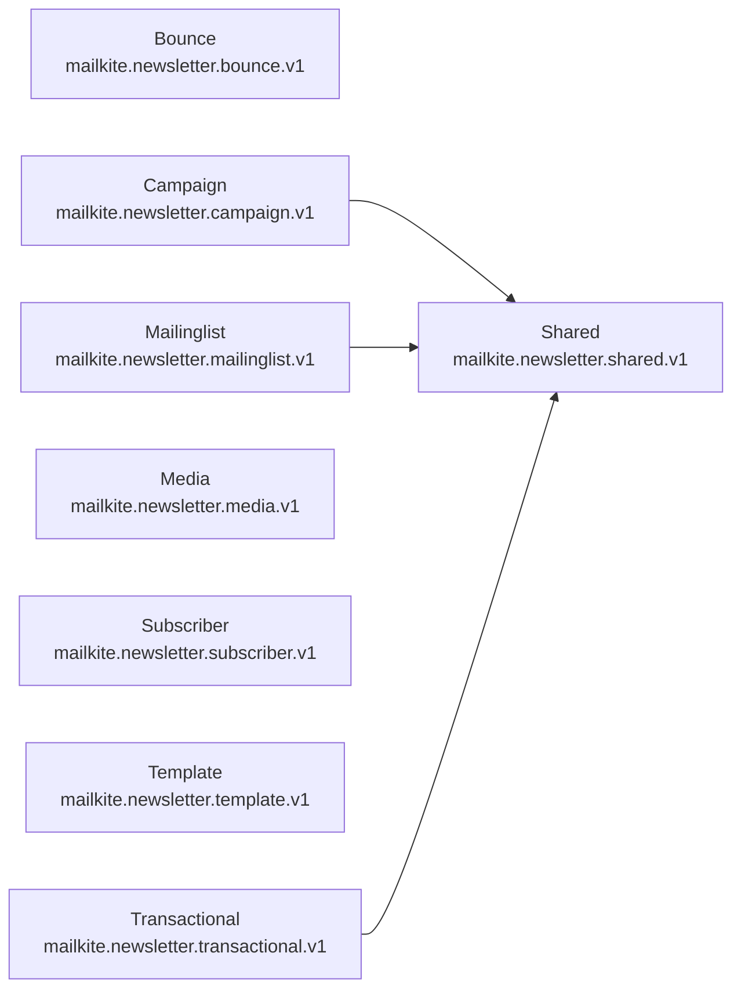

# mailkite Protobuf APIs

> [!IMPORTANT]
> Auto-generated by `protodoc`. Do not edit manually.

Every protobuf module under `protobuf/`. Each row links to that module's generated reference.

## Modules

| Module | Package | Services | Messages | Enums | Reference |
| --- | --- | --- | --- | --- | --- |
| Bounce | `mailkite.newsletter.bounce.v1` | 1 | 6 | 1 | [README](mailkite/newsletter/bounce/README.md) |
| Campaign | `mailkite.newsletter.campaign.v1` | 1 | 16 | 4 | [README](mailkite/newsletter/campaign/README.md) |
| Mailinglist | `mailkite.newsletter.mailinglist.v1` | 1 | 7 | 2 | [README](mailkite/newsletter/mailinglist/README.md) |
| Media | `mailkite.newsletter.media.v1` | 1 | 7 | 0 | [README](mailkite/newsletter/media/README.md) |
| Shared | `mailkite.newsletter.shared.v1` | 0 | 2 | 2 | [README](mailkite/newsletter/shared/README.md) |
| Subscriber | `mailkite.newsletter.subscriber.v1` | 1 | 22 | 5 | [README](mailkite/newsletter/subscriber/README.md) |
| Template | `mailkite.newsletter.template.v1` | 1 | 8 | 2 | [README](mailkite/newsletter/template/README.md) |
| Transactional | `mailkite.newsletter.transactional.v1` | 1 | 3 | 0 | [README](mailkite/newsletter/transactional/README.md) |
| **Total** | _8 modules_ | 7 | 71 | 16 | |

## Dependency graph

Local (`mailkite.*`) import relationships between modules. External deps (`google.*`, `mcp.*`) are omitted.

---

© 2026 oh-tarnished | Apache 2.0 License
