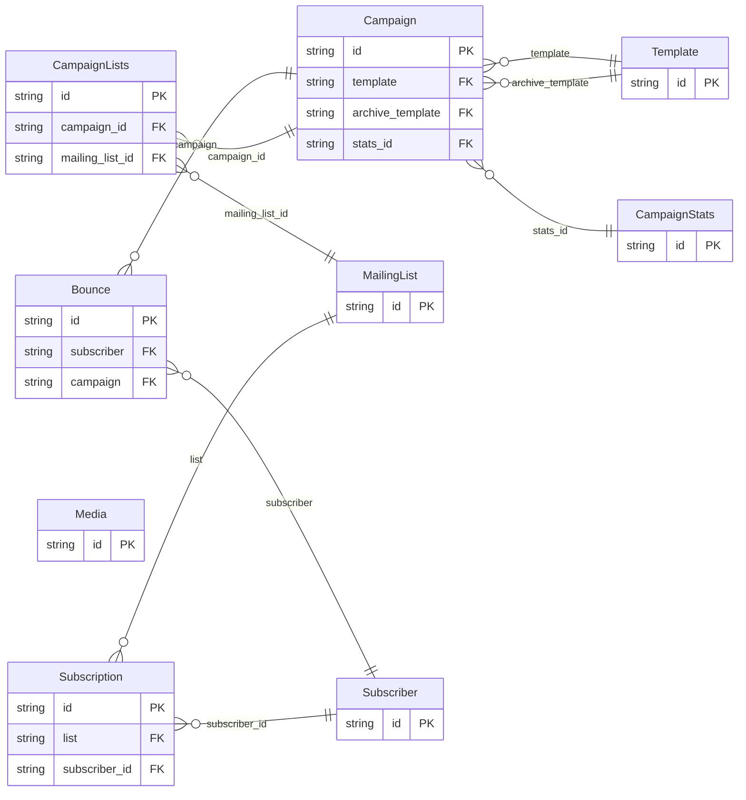

<!-- Code generated by protoc-gen-protorm. DO NOT EDIT. -->

# `mailkite` — GORM models

Go structs with GORM struct tags — one package per schema.

Generated from Protobuf by protoc-gen-protorm. Source of truth is the `.proto` files — regenerate rather than editing.

| Models | Enums |
| ---: | ---: |
| 9 | 9 |

## Entity relationships

## Output

- `<schema>/models.go` — one Go package per schema, one struct per table.
- `migrate.go` — a factory `Registry` (with a preloaded `Default`) that migrates every model in one call; emitted when the `go_module` opt is set.
- Nullable columns are pointer types; proto enums become string-typed Go enums.
- Attach in main: `Default.Migrate(db)`, or wire the structs into a `*gorm.DB` and run AutoMigrate yourself.
- `<schema>/<model>_store.go` — a typed CRUD store per resource (Create, GetByID, List, Count, Update, DeleteByID, plus GetBy/ListBy finders for unique and foreign-key columns), sharing `<schema>/store_options.go`; emitted when the `stores` opt is set. Requires `gorm.io/gorm`.
- `Registry.Instrument(db)` in `migrate.go` — installs the OpenTelemetry GORM tracing plugin; on by default (set the `otel` opt false to omit), emitted with `go_module`. Requires `gorm.io/plugin/opentelemetry`.

## Schema `bounce`

### `Bounce` → `resource`

A delivery failure or complaint recorded against a subscriber. Read-only; mailkite surfaces these for deliverability monitoring.

| Column | Type | Null |
| --- | --- | --- |
| `id` | `CHAR(26)` | not null |
| `name` | `VARCHAR(255)` | not null |
| `subscriber` | `CHAR(26)` | nullable |
| `campaign` | `CHAR(26)` | nullable |
| `campaign_display_name` | `VARCHAR(255)` | nullable |
| `email` | `VARCHAR(255)` | nullable |
| `type` | `BounceType` | nullable |
| `source` | `VARCHAR(255)` | nullable |
| `meta` | `JSONB` | nullable |
| `create_time` | `TIMESTAMPTZ` | not null |

### Enums

- `BounceType`: HARD, SOFT, COMPLAINT

## Schema `campaign`

### `Campaign` → `resource`

A single newsletter send: rendered content, its audience, and its lifecycle. In mailkite a Campaign is the materialization of one scheduled digest of normalized content items.

| Column | Type | Null |
| --- | --- | --- |
| `id` | `CHAR(26)` | not null |
| `name` | `VARCHAR(255)` | not null |
| `uuid` | `VARCHAR(255)` | nullable |
| `display_name` | `VARCHAR(255)` | not null |
| `subject` | `VARCHAR(255)` | not null |
| `sender_email` | `VARCHAR(255)` | nullable |
| `type` | `CampaignType` | nullable |
| `format` | `ContentType` | not null |
| `body` | `VARCHAR(255)` | nullable |
| `alt_body` | `VARCHAR(255)` | nullable |
| `template` | `CHAR(26)` | nullable |
| `tags` | `VARCHAR(255)[]` | nullable |
| `messenger` | `VARCHAR(255)` | nullable |
| `headers` | `JSONB` | nullable |
| `schedule_time` | `TIMESTAMPTZ` | nullable |
| `state` | `CampaignState` | nullable |
| `archive` | `BOOLEAN` | nullable |
| `archive_slug` | `VARCHAR(255)` | nullable |
| `archive_template` | `CHAR(26)` | nullable |
| `archive_meta` | `JSONB` | nullable |
| `create_time` | `TIMESTAMPTZ` | not null |
| `update_time` | `TIMESTAMPTZ` | not null |
| `start_time` | `TIMESTAMPTZ` | nullable |
| `stats_id` | `CHAR(26)` | nullable |

### `CampaignStats` → `stats`

Aggregate counters for a campaign.

| Column | Type | Null |
| --- | --- | --- |
| `id` | `CHAR(26)` | not null |
| `recipient_count` | `BIGINT` | nullable |
| `sent` | `BIGINT` | nullable |
| `views` | `BIGINT` | nullable |
| `clicks` | `BIGINT` | nullable |
| `bounces` | `BIGINT` | nullable |

### `CampaignLists` → `lists`

Join table for the many-to-many relation Campaign.lists ↔ MailingList.

| Column | Type | Null |
| --- | --- | --- |
| `id` | `CHAR(26)` | not null |
| `campaign_id` | `CHAR(26)` | not null |
| `mailing_list_id` | `CHAR(26)` | not null |

### Enums

- `CampaignType`: REGULAR, OPTIN
- `ContentType`: RICHTEXT, HTML, MARKDOWN, PLAIN, VISUAL
- `CampaignState`: DRAFT, SCHEDULED, RUNNING, PAUSED, CANCELLED, FINISHED

## Schema `mailinglist`

### `MailingList` → `resource`

An audience segment subscribers belong to. In mailkite, lists are the unit of tenancy: typically one private list per company plus one public merged "group" list aggregating every brand's feed.

| Column | Type | Null |
| --- | --- | --- |
| `id` | `CHAR(26)` | not null |
| `name` | `VARCHAR(255)` | not null |
| `uuid` | `VARCHAR(255)` | nullable |
| `display_name` | `VARCHAR(255)` | not null |
| `description` | `VARCHAR(255)` | nullable |
| `type` | `ListType` | not null |
| `optin` | `OptinType` | not null |
| `tags` | `VARCHAR(255)[]` | nullable |
| `subscriber_count` | `BIGINT` | nullable |
| `subscriber_statuses` | `JSONB` | nullable |
| `create_time` | `TIMESTAMPTZ` | not null |
| `update_time` | `TIMESTAMPTZ` | not null |

### Enums

- `ListType`: PUBLIC, PRIVATE
- `OptinType`: SINGLE, DOUBLE

## Schema `media`

### `Media` → `resource`

An uploaded asset (image, attachment) referenced by campaigns and templates.

| Column | Type | Null |
| --- | --- | --- |
| `id` | `CHAR(26)` | not null |
| `name` | `VARCHAR(255)` | not null |
| `uuid` | `VARCHAR(255)` | nullable |
| `filename` | `VARCHAR(255)` | nullable |
| `mime_type` | `VARCHAR(255)` | nullable |
| `url` | `VARCHAR(255)` | nullable |
| `thumbnail_url` | `VARCHAR(255)` | nullable |
| `create_time` | `TIMESTAMPTZ` | not null |

## Schema `subscriber`

### `Subscriber` → `resource`

A person who can receive newsletters. Subscribers are global; their relationship to each list is captured by a Subscription.

| Column | Type | Null |
| --- | --- | --- |
| `id` | `CHAR(26)` | not null |
| `name` | `VARCHAR(255)` | not null |
| `uuid` | `VARCHAR(255)` | nullable |
| `email` | `VARCHAR(255)` | not null |
| `display_name` | `VARCHAR(255)` | not null |
| `state` | `SubscriberState` | nullable |
| `attributes` | `JSONB` | nullable |
| `create_time` | `TIMESTAMPTZ` | not null |
| `update_time` | `TIMESTAMPTZ` | not null |

### `Subscription` → `subscriptions`

The membership of a subscriber in a single list.

| Column | Type | Null |
| --- | --- | --- |
| `id` | `CHAR(26)` | not null |
| `list` | `CHAR(26)` | nullable |
| `list_display_name` | `VARCHAR(255)` | nullable |
| `state` | `SubscriptionState` | nullable |
| `create_time` | `TIMESTAMPTZ` | not null |
| `subscriber_id` | `CHAR(26)` | not null |

### Enums

- `SubscriberState`: ENABLED, BLOCKLISTED
- `SubscriptionState`: UNCONFIRMED, CONFIRMED, UNSUBSCRIBED

## Schema `template`

### `Template` → `resource`

A reusable layout (HTML/markdown wrapper) applied to campaigns or transactional messages.

| Column | Type | Null |
| --- | --- | --- |
| `id` | `CHAR(26)` | not null |
| `name` | `VARCHAR(255)` | not null |
| `display_name` | `VARCHAR(255)` | not null |
| `type` | `TemplateType` | not null |
| `subject` | `VARCHAR(255)` | nullable |
| `body` | `VARCHAR(255)` | not null |
| `is_default` | `BOOLEAN` | nullable |
| `create_time` | `TIMESTAMPTZ` | not null |
| `update_time` | `TIMESTAMPTZ` | not null |

### Enums

- `TemplateType`: CAMPAIGN, CAMPAIGN_VISUAL, TRANSACTIONAL
