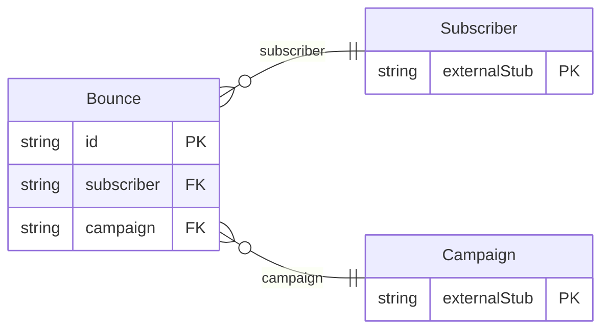

<!-- Code generated by protoc-gen-protorm. DO NOT EDIT. -->

# `mailkite/newsletter/bounce/bounce/` — Prisma schema

Generated from Protobuf by protoc-gen-protorm. Source of truth is the `.proto` files — regenerate rather than editing.

| Models | Enums |
| ---: | ---: |
| 1 | 0 |

## Entity relationships

Schema file: [`bounce.postgres.prisma`](./bounce.postgres.prisma)

### `Bounce` → `resource`

A delivery failure or complaint recorded against a subscriber. Read-only; mailkite surfaces these for deliverability monitoring.

| Column | Type | Null |
| --- | --- | --- |
| `id` | `CHAR(26)` | not null |
| `name` | `VARCHAR(255)` | not null |
| `subscriber` | `CHAR(26)` | nullable |
| `campaign` | `CHAR(26)` | nullable |
| `campaign_display_name` | `VARCHAR(255)` | nullable |
| `email` | `VARCHAR(255)` | nullable |
| `type` | `BounceType` | nullable |
| `source` | `VARCHAR(255)` | nullable |
| `meta` | `JSONB` | nullable |
| `create_time` | `TIMESTAMPTZ` | not null |
