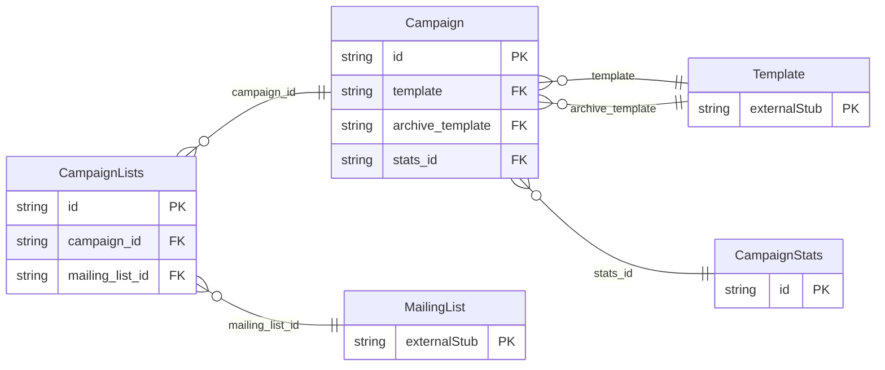

<!-- Code generated by protoc-gen-protorm. DO NOT EDIT. -->

# `mailkite/newsletter/campaign/` — Prisma schema

Generated from Protobuf by protoc-gen-protorm. Source of truth is the `.proto` files — regenerate rather than editing.

| Models | Enums |
| ---: | ---: |
| 3 | 2 |

## Entity relationships

## Subfolders

- [`campaign/`](./campaign/README.md)
- [`enums/`](./enums/README.md)
