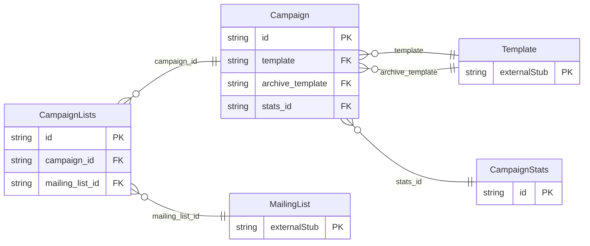

<!-- Code generated by protoc-gen-protorm. DO NOT EDIT. -->

# `mailkite/newsletter/campaign/campaign/` — Prisma schema

Generated from Protobuf by protoc-gen-protorm. Source of truth is the `.proto` files — regenerate rather than editing.

| Models | Enums |
| ---: | ---: |
| 3 | 0 |

## Entity relationships

Schema file: [`campaign.postgres.prisma`](./campaign.postgres.prisma)

### `Campaign` → `resource`

A single newsletter send: rendered content, its audience, and its lifecycle. In mailkite a Campaign is the materialization of one scheduled digest of normalized content items.

| Column | Type | Null |
| --- | --- | --- |
| `id` | `CHAR(26)` | not null |
| `name` | `VARCHAR(255)` | not null |
| `uuid` | `VARCHAR(255)` | nullable |
| `display_name` | `VARCHAR(255)` | not null |
| `subject` | `VARCHAR(255)` | not null |
| `sender_email` | `VARCHAR(255)` | nullable |
| `type` | `CampaignType` | nullable |
| `format` | `ContentType` | not null |
| `body` | `VARCHAR(255)` | nullable |
| `alt_body` | `VARCHAR(255)` | nullable |
| `template` | `CHAR(26)` | nullable |
| `tags` | `VARCHAR(255)[]` | nullable |
| `messenger` | `VARCHAR(255)` | nullable |
| `headers` | `JSONB` | nullable |
| `schedule_time` | `TIMESTAMPTZ` | nullable |
| `state` | `CampaignState` | nullable |
| `archive` | `BOOLEAN` | nullable |
| `archive_slug` | `VARCHAR(255)` | nullable |
| `archive_template` | `CHAR(26)` | nullable |
| `archive_meta` | `JSONB` | nullable |
| `create_time` | `TIMESTAMPTZ` | not null |
| `update_time` | `TIMESTAMPTZ` | not null |
| `start_time` | `TIMESTAMPTZ` | nullable |
| `stats_id` | `CHAR(26)` | nullable |

### `CampaignStats` → `stats`

Aggregate counters for a campaign.

| Column | Type | Null |
| --- | --- | --- |
| `id` | `CHAR(26)` | not null |
| `recipient_count` | `BIGINT` | nullable |
| `sent` | `BIGINT` | nullable |
| `views` | `BIGINT` | nullable |
| `clicks` | `BIGINT` | nullable |
| `bounces` | `BIGINT` | nullable |

### `CampaignLists` → `lists`

Join table for the many-to-many relation Campaign.lists ↔ MailingList.

| Column | Type | Null |
| --- | --- | --- |
| `id` | `CHAR(26)` | not null |
| `campaign_id` | `CHAR(26)` | not null |
| `mailing_list_id` | `CHAR(26)` | not null |
