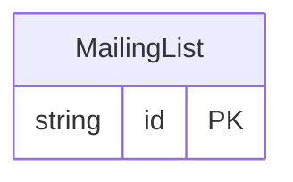

<!-- Code generated by protoc-gen-protorm. DO NOT EDIT. -->

# `mailkite/newsletter/mailinglist/mailing_list/` — Prisma schema

Generated from Protobuf by protoc-gen-protorm. Source of truth is the `.proto` files — regenerate rather than editing.

| Models | Enums |
| ---: | ---: |
| 1 | 0 |

## Entity relationships

Schema file: [`mailing_list.postgres.prisma`](./mailing_list.postgres.prisma)

### `MailingList` → `resource`

An audience segment subscribers belong to. In mailkite, lists are the unit of tenancy: typically one private list per company plus one public merged "group" list aggregating every brand's feed.

| Column | Type | Null |
| --- | --- | --- |
| `id` | `CHAR(26)` | not null |
| `name` | `VARCHAR(255)` | not null |
| `uuid` | `VARCHAR(255)` | nullable |
| `display_name` | `VARCHAR(255)` | not null |
| `description` | `VARCHAR(255)` | nullable |
| `type` | `ListType` | not null |
| `optin` | `OptinType` | not null |
| `tags` | `VARCHAR(255)[]` | nullable |
| `subscriber_count` | `BIGINT` | nullable |
| `subscriber_statuses` | `JSONB` | nullable |
| `create_time` | `TIMESTAMPTZ` | not null |
| `update_time` | `TIMESTAMPTZ` | not null |
