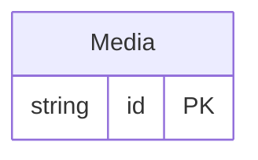

<!-- Code generated by protoc-gen-protorm. DO NOT EDIT. -->

# `mailkite/newsletter/media/media/` — Prisma schema

Generated from Protobuf by protoc-gen-protorm. Source of truth is the `.proto` files — regenerate rather than editing.

| Models | Enums |
| ---: | ---: |
| 1 | 0 |

## Entity relationships

Schema file: [`media.postgres.prisma`](./media.postgres.prisma)

### `Media` → `resource`

An uploaded asset (image, attachment) referenced by campaigns and templates.

| Column | Type | Null |
| --- | --- | --- |
| `id` | `CHAR(26)` | not null |
| `name` | `VARCHAR(255)` | not null |
| `uuid` | `VARCHAR(255)` | nullable |
| `filename` | `VARCHAR(255)` | nullable |
| `mime_type` | `VARCHAR(255)` | nullable |
| `url` | `VARCHAR(255)` | nullable |
| `thumbnail_url` | `VARCHAR(255)` | nullable |
| `create_time` | `TIMESTAMPTZ` | not null |
