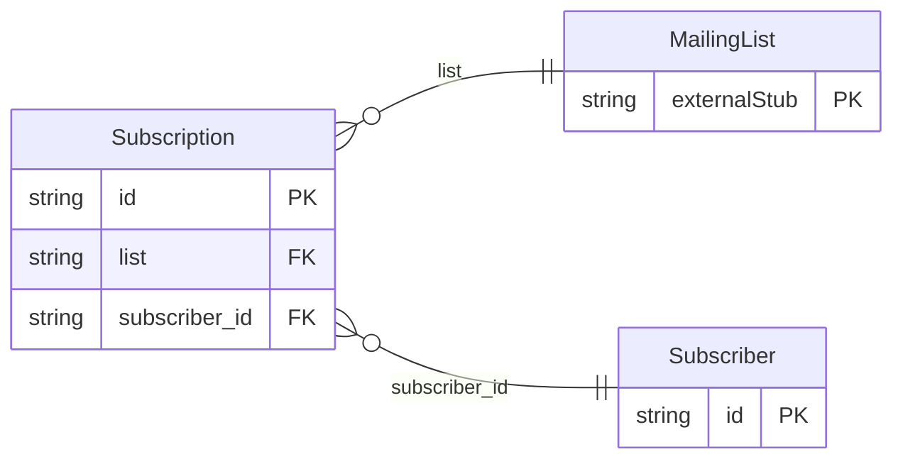

<!-- Code generated by protoc-gen-protorm. DO NOT EDIT. -->

# `mailkite/newsletter/subscriber/` — Prisma schema

Generated from Protobuf by protoc-gen-protorm. Source of truth is the `.proto` files — regenerate rather than editing.

| Models | Enums |
| ---: | ---: |
| 2 | 2 |

## Entity relationships

## Subfolders

- [`enums/`](./enums/README.md)
- [`subscriber/`](./subscriber/README.md)
