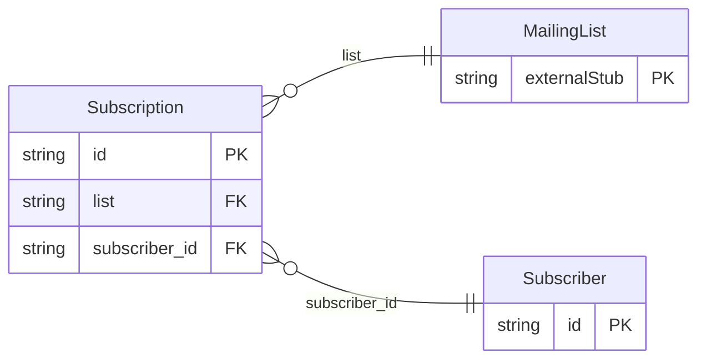

<!-- Code generated by protoc-gen-protorm. DO NOT EDIT. -->

# `mailkite/newsletter/subscriber/subscriber/` — Prisma schema

Generated from Protobuf by protoc-gen-protorm. Source of truth is the `.proto` files — regenerate rather than editing.

| Models | Enums |
| ---: | ---: |
| 2 | 0 |

## Entity relationships

Schema file: [`subscriber.postgres.prisma`](./subscriber.postgres.prisma)

### `Subscriber` → `resource`

A person who can receive newsletters. Subscribers are global; their relationship to each list is captured by a Subscription.

| Column | Type | Null |
| --- | --- | --- |
| `id` | `CHAR(26)` | not null |
| `name` | `VARCHAR(255)` | not null |
| `uuid` | `VARCHAR(255)` | nullable |
| `email` | `VARCHAR(255)` | not null |
| `display_name` | `VARCHAR(255)` | not null |
| `state` | `SubscriberState` | nullable |
| `attributes` | `JSONB` | nullable |
| `create_time` | `TIMESTAMPTZ` | not null |
| `update_time` | `TIMESTAMPTZ` | not null |

### `Subscription` → `subscriptions`

The membership of a subscriber in a single list.

| Column | Type | Null |
| --- | --- | --- |
| `id` | `CHAR(26)` | not null |
| `list` | `CHAR(26)` | nullable |
| `list_display_name` | `VARCHAR(255)` | nullable |
| `state` | `SubscriptionState` | nullable |
| `create_time` | `TIMESTAMPTZ` | not null |
| `subscriber_id` | `CHAR(26)` | not null |
