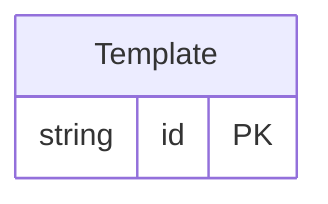

<!-- Code generated by protoc-gen-protorm. DO NOT EDIT. -->

# `mailkite/newsletter/template/template/` — Prisma schema

Generated from Protobuf by protoc-gen-protorm. Source of truth is the `.proto` files — regenerate rather than editing.

| Models | Enums |
| ---: | ---: |
| 1 | 1 |

## Entity relationships

Schema file: [`template.postgres.prisma`](./template.postgres.prisma)

### `Template` → `resource`

A reusable layout (HTML/markdown wrapper) applied to campaigns or transactional messages.

| Column | Type | Null |
| --- | --- | --- |
| `id` | `CHAR(26)` | not null |
| `name` | `VARCHAR(255)` | not null |
| `display_name` | `VARCHAR(255)` | not null |
| `type` | `TemplateType` | not null |
| `subject` | `VARCHAR(255)` | nullable |
| `body` | `VARCHAR(255)` | not null |
| `is_default` | `BOOLEAN` | nullable |
| `create_time` | `TIMESTAMPTZ` | not null |
| `update_time` | `TIMESTAMPTZ` | not null |

### Enums

- `TemplateType`: CAMPAIGN, CAMPAIGN_VISUAL, TRANSACTIONAL
